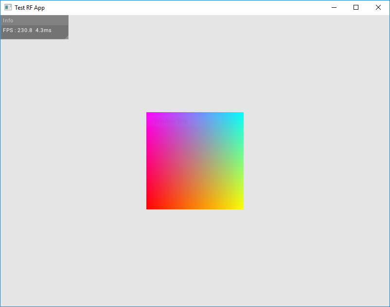

# Radar Rendering Foundation
GLFW/GL4 rendering framework and general useful utilities

- File Operations (Disk Copy, Filepath finding, File reading...)
- Logger utility with different log levels and timestamping
- Linear algebra single header math library (vec2, vec3, vec4, mat3, mat4, general utils)
- Windowing utils : context creation, input handling, window events
- Rendering utils
    - Resource handling and storing (textures, images, fonts)
    - Font rendering (stb_truetype)
    - Texture loading and creation (2D, 3D, Cubemap, Irradiance Prefiltering)
    - Mesh handling (VAO, VBO, GLTF mesh loading)
    - Frambuffer utils (GBuffer, auxilliary fbos)
    - 2D Display text rendering
- User Interface
    - Implementation of an immediate-mode UI (à la imgui)
    - Panel with mouse move and resize
    - Border and titlebar
    - Button
    - Slider
    - Text
    - 2D image display
    - Progressbar

The library is initialized by ctx::Init() and demands 2 memory pools in input to make its internal allocations with.
One Scratch memory pool for temporary allocs (file buffers, temp mesh vertex data, ...). Those are considered in-place
and ephemeral and the memory pool this data is using should be zero'ed every frame.
One Session memory pool for more permanent storage (image/texture data, UI internal state, the context itself, ...).

## RF Example Application



- rf_example.cpp is an example application running very basic features of the RF library to bootstrap new projects. It should draw some UI as well as a colored 2D quad.
- ui_config.json is an example theme config file for the RF UI. RF handles TTF fonts, as well as Unicode character printing (like [FontAwesome](https://fontawesome.com/)), these should be put in the application path and linked with the ui theme config file.

### Build
Example build on Win10 64 using Cmder and the provided premake5 file.
```bash
mkdir rf_example
cd rf_example/
git clone --recurse-submodules https://github.com/Adrien-radr/rf ext/rf
mkdir src bin\data
cp -R ext/rf/examples/* .
premake5.exe vs2017 --os=windows # depending on target platform
# you might have to retarget the solution to the last windows SDK in the resulting vs project
```

