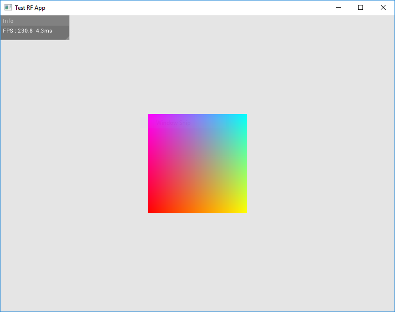

# RF Example Application



- rf_example.cpp is an example application running very basic features of the RF library to bootstrap new projects. It should draw some UI as well as a colored 2D quad. The UI won't display text if no font is placed in the executable directory and linked with the UI theme config file.
- ui_config.json is an example theme config file for the RF UI. RF handles TTF fonts, as well as Unicode character printing (like [FontAwesome](https://fontawesome.com/)), these should be put in the application path and linked with the ui theme config file.

## Build

```bash
mkdir rf_example
cd rf_example/
git clone --recurse-submodules https://github.com/Adrien-radr/rf ext/rf
mkdir src bin\data
cp -R ext/rf/examples/* .
premake5.exe vs2017 --os=windows # depending on target platform
# you might have to retarget the solution to the last windows SDK in the resulting vs project
```
